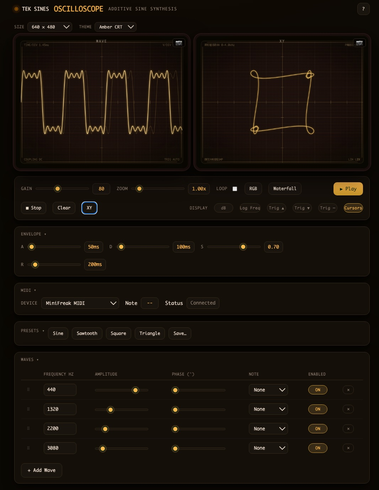

# Tek Sines

A single-file, zero-dependency browser instrument for **additive sine synthesis**, presented as a pair of CRT oscilloscope screens. Build sounds by stacking sine partials and watch the resulting waveform *and* its spectrum update live as you tweak each harmonic.

No build step, no package manager, no frameworks — just one `sines.html` you can open directly in a browser.

## Screenshot



## Features

### Two live scopes, one signal source
- **Wave** — a time-domain trace of the summed buffer with phosphor persistence, graticule, scanlines, and a CRT bezel.
- **Spectrum** — a real-time FFT magnitude display (radix-2, 4096-point, Hann-windowed). For an additive synth this is the payoff: the bars sit exactly on the partials you're stacking, so a sawtooth shows a `1/n` staircase and a square shows only odd harmonics.

### Additive synthesis engine
- Add any number of sine waves; each is summed into a single shared audio buffer.
- Per-wave controls: **frequency** (direct Hz entry or a 108-note C0–B8 dropdown), **amplitude**, **phase**, **detune** (±50¢ fine-tuning for chorus effects), **enable/disable**, and **remove**.
- Switch any wave between **Sine** and **Noise** mode. Noise waves offer three colors: **white**, **pink** (perceptually flat), and **brown** (red spectrum).
- Classic-waveform **presets** built additively from harmonics: Sine, Sawtooth (`1/n`), Square (odd harmonics, `1/n`), Triangle (odd harmonics, `1/n²`, alternating phase).

### Transport & master controls
- Play / Stop / Loop, master Gain, and time-base Zoom.
- A 2-second buffer is generated at the AudioContext's real sample rate and played back through the Web Audio API.

### Cross-browser audio
- The `AudioContext` is created lazily on the first user gesture (Play), satisfying Safari/Chrome autoplay rules. The buffer is allocated at the context's *actual* sample rate (often 48000 on Safari/iOS), which avoids the silent-playback pitfall of a hardcoded 44100.

## Running

Open `sines.html` in any Web Audio-capable browser, or serve it and visit the page:

```bash
python3 -m http.server
# then open http://localhost:8000/sines.html
```

Click a preset (or add waves manually) and hit **Play**.

## How it works

All code lives in a single `<script>` block inside `sines.html`, organized into clearly commented sections: Constants → note table → State → `Wave` model → audio synthesis → FFT → canvas rendering → Web Audio → UI handlers → row construction → presets → DOM init.

The core invariant: one `Float32Array` (`buf`) is the source of truth for **audio playback, the waveform render, and the spectrum**. Any change to a wave re-fills `buf` (zero it, then re-sum) and redraws both screens, so controls, sound, and visuals never drift apart.

The spectrum is a self-contained radix-2 Cooley–Tukey FFT (no library). It windows the first 4096 samples of `buf`, and the result is cached behind a dirty flag set whenever `buf` is rewritten — so view-only changes (e.g. dragging Zoom) don't recompute the transform.

## Controls reference

| Control | What it does |
| --- | --- |
| Presets (Sine / Saw / Square / Triangle) | Replace all waves with an additive classic waveform |
| + Add Wave | Append a new sine partial |
| Frequency (Hz) | Type a frequency directly |
| Note dropdown | Snap to an equal-temperament pitch (C0–B8) |
| Amplitude | Per-wave level |
| Phase (°) | Per-wave phase offset |
| Detune (¢) | Fine-tune ±50 cents for chorus/thickening effects |
| Type (SINE / NOISE) | Toggle between sine and noise generation per wave |
| Noise Color | For noise-type waves: White, Pink, or Brown |
| ON / OFF | Toggle a partial in and out of the mix |
| ✕ | Remove a wave |
| Gain | Master output level |
| Zoom | Time-base samples-per-pixel of the waveform |
| Loop | Loop the 2-second buffer |
| Play / Stop | Transport |

## Testing

Run the test suite (Node.js, no dependencies):

```bash
node test.js
```

Tests cover: FFT correctness, buffer synthesis, note frequency table, Wave model, presets, serialize/deserialize, display toggles, and more. CI runs these automatically on every pull request via GitHub Actions.

To sanity-check that the JavaScript parses:

```bash
node -e 'new Function(require("fs").readFileSync("sines.html","utf-8").match(/<script>([\s\S]*?)<\/script>/)[1])'
```

After touching synthesis or rendering, load each preset and confirm the waveform *and* spectrum show the expected shape — e.g. **Square** should show only odd harmonics in the spectrum, **Triangle** a `1/n²` falloff.

## Browser support

Modern Chromium, Firefox, and Safari. Audio requires a Web Audio-capable browser; the `webkitAudioContext` prefix is handled for Safari.

## Project layout

```
sines.html                        # the entire app: inline <style> + one <script> block
test.js                           # test suite (Node.js, no dependencies)
.github/workflows/test.yml       # CI: runs tests on PRs and pushes to master
CLAUDE.md                         # architecture notes and editing invariants for AI assistants
README.md                         # this file
```
